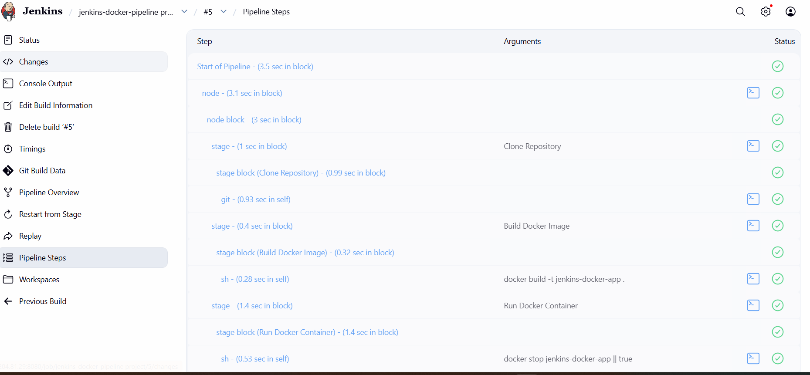
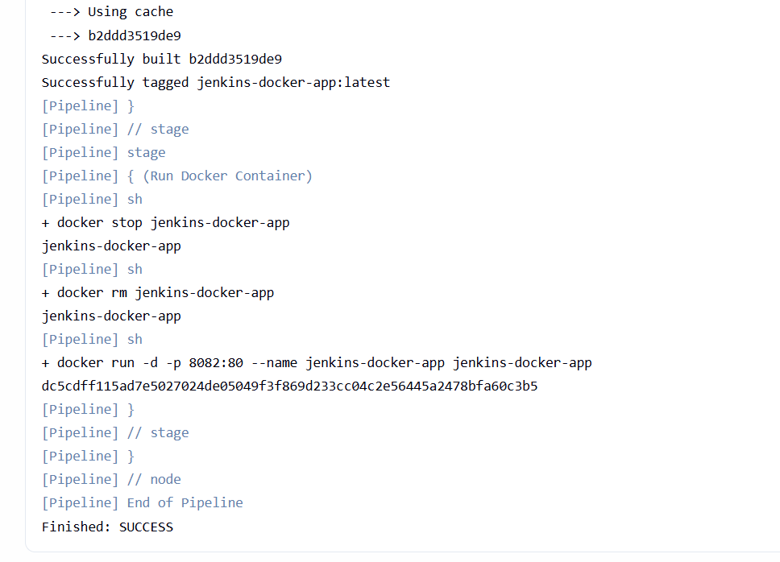
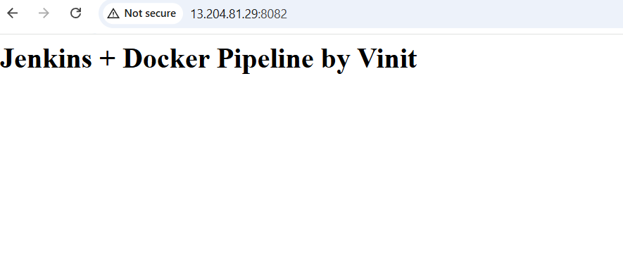

# CI/CD Pipeline with Jenkins + Docker

A fully automated CI/CD pipeline that builds and deploys a Dockerized web application using Jenkins running on AWS EC2.

---

## 🚀 Project Overview

This project demonstrates how to automate the build and deployment of a containerized web application using Jenkins pipelines and Docker. Every time the pipeline is triggered, Jenkins pulls the latest code, builds a Docker image, and deploys a fresh container — all automatically.

---

## 🛠️ Tools & Technologies

| Tool | Purpose |
|---|---|
| Jenkins | CI/CD pipeline automation |
| Docker | Containerization |
| Nginx | Web server inside container |
| Git & GitHub | Source code management |
| AWS EC2 | Cloud server (Ubuntu) |

---

## 📐 Architecture & Flow

```
GitHub Repository
       │
       ▼
Jenkins (Port 8080)
       │
       ├── Stage 1: Clone Repository from GitHub
       │
       ├── Stage 2: Build Docker Image
       │
       └── Stage 3: Run Docker Container (Port 8082)
                        │
                        ▼
               Nginx Web Server
               serving index.html
```

---

## 📁 Project Structure

```
jenkins-docker-pipeline/
├── index.html       # Simple web application
├── Dockerfile       # Docker image configuration
└── Jenkinsfile      # Jenkins pipeline script
```

---

## ⚙️ Pipeline Stages

### Stage 1 — Clone Repository
Jenkins pulls the latest code from the GitHub repository.

### Stage 2 — Build Docker Image
Jenkins builds a Docker image using the Dockerfile:
```dockerfile
FROM nginx:alpine
COPY index.html /usr/share/nginx/html/index.html
```

### Stage 3 — Run Docker Container
Jenkins stops any existing container, removes it, and runs a fresh one:
```bash
docker stop jenkins-docker-app || true
docker rm jenkins-docker-app || true
docker run -d -p 8082:80 --name jenkins-docker-app jenkins-docker-app
```

---

## 🖥️ Setup & How to Run

### Prerequisites
- AWS EC2 instance (Ubuntu)
- Jenkins installed and running on port 8080
- Docker installed on EC2
- Jenkins user added to Docker group

### Step 1 — Give Jenkins Docker Permission
```bash
sudo usermod -aG docker jenkins
sudo systemctl restart jenkins
```

### Step 2 — Create Jenkins Pipeline Job
1. Open Jenkins at `http://<your-ec2-ip>:8080`
2. Click **New Item** → Select **Pipeline**
3. Under Pipeline section select **Pipeline script**
4. Paste the Jenkinsfile content
5. Click **Save**

### Step 3 — Trigger the Pipeline
1. Click **Build Now**
2. Watch the pipeline execute all 3 stages
3. Access the app at `http://<your-ec2-ip>:8082`

---

## 📸 Screenshots

### ✅ Pipeline Stages


### ✅ Finished: SUCCESS


### ✅ App Running in Browser


---

## 🔑 Key Concepts Learned

- Writing a **Jenkinsfile** with multiple stages
- Giving Jenkins permission to interact with Docker daemon
- Building and running Docker containers via Jenkins pipeline
- Debugging real-world CI/CD errors (permission denied on Docker socket)
- Running Jenkins and Docker on AWS EC2
